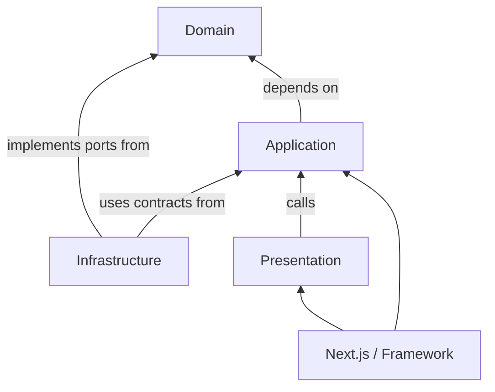

# Project Rules

This directory contains the project's canonical engineering rules.

The rules are intentionally split by responsibility. Each file should contain only rules that belong to its subject area. Avoid duplicating rules across files; reference the appropriate rule instead.

## Rule hierarchy

```mermaid
graph TD
  ARCH["architecture.md"]

  ARCH --> STRUCT["Structure"]
  ARCH --> FW["Framework"]
  ARCH --> APPD["Application"]
  ARCH --> PRES["Presentation"]
  ARCH --> CROSS["Cross-cutting"]
  ARCH --> CODE["Code"]

  STRUCT --> BOUND["boundaries.md"]
  STRUCT --> MOD["modules.md"]
  STRUCT --> DEP["dependencies.md"]
  STRUCT --> SHARED["shared.md"]

  FW --> NEXT["nextjs.md"]
  FW --> REACT["react.md"]
  FW --> API["api.md"]
  FW --> CACHE["caching.md"]

  APPD --> VALID["validation.md"]
  APPD --> ERR["errors.md"]
  APPD --> PERSIST["persistence.md"]

  PRES --> STY["styling.md"]
  PRES --> I18N["i18n.md"]
  PRES --> A11Y["accessibility.md"]

  CROSS --> SEC["security.md"]
  CROSS --> CONF["configuration.md"]
  CROSS --> OBS["observability.md"]
  CROSS --> PERF["performance.md"]
  CROSS --> TEST["testing.md"]

  CODE --> TS["typescript.md"]
  CODE --> NAME["naming.md"]
  CODE --> STYLE["code-style.md"]
  CODE --> COM["comments.md"]
```



## Code dependency direction

The architectural dependency direction is:



Allowed direction:

| From           | May depend on                                   |
| -------------- | ----------------------------------------------- |
| Next.js        | Presentation, Application                       |
| Presentation   | Application contracts, Shared UI                |
| Infrastructure | Domain (including ports), Application contracts |
| Application    | Domain (including ports)                        |
| Domain         | Nothing outside the domain                      |

Ports are defined in the domain and implemented in infrastructure. Enforced import rules live in [`boundaries.md`](boundaries.md). The dependency direction must be enforced by tooling wherever practical.

## Rule ownership

| Concern                                   | Rule                                   |
| ----------------------------------------- | -------------------------------------- |
| Overall architecture                      | [`architecture.md`](architecture.md)   |
| Import/dependency boundaries              | [`boundaries.md`](boundaries.md)       |
| Module structure                          | [`modules.md`](modules.md)             |
| Package/dependency choices                | [`dependencies.md`](dependencies.md)   |
| Shared code (`src/lib`, `src/components`) | [`shared.md`](shared.md)               |
| Next.js                                   | [`nextjs.md`](nextjs.md)               |
| React                                     | [`react.md`](react.md)                 |
| HTTP and APIs                             | [`api.md`](api.md)                     |
| Caching                                   | [`caching.md`](caching.md)             |
| Runtime validation / Zod                  | [`validation.md`](validation.md)       |
| Errors / neverthrow                       | [`errors.md`](errors.md)               |
| Persistence / Prisma                      | [`persistence.md`](persistence.md)     |
| TypeScript                                | [`typescript.md`](typescript.md)       |
| Naming conventions                        | [`naming.md`](naming.md)               |
| Code style                                | [`code-style.md`](code-style.md)       |
| Comments / documentation                  | [`comments.md`](comments.md)           |
| Styling / design system                   | [`styling.md`](styling.md)             |
| Internationalization                      | [`i18n.md`](i18n.md)                   |
| Accessibility                             | [`accessibility.md`](accessibility.md) |
| Performance                               | [`performance.md`](performance.md)     |
| Security / authentication / authorization | [`security.md`](security.md)           |
| Environment / configuration               | [`configuration.md`](configuration.md) |
| Testing                                   | [`testing.md`](testing.md)             |
| Logging / tracing / telemetry             | [`observability.md`](observability.md) |

## Rules directory

```text
rules/
├── README.md
│
├── architecture.md
├── boundaries.md
├── modules.md
├── dependencies.md
├── shared.md
│
├── nextjs.md
├── react.md
├── api.md
├── caching.md
│
├── validation.md
├── errors.md
├── persistence.md
│
├── typescript.md
├── naming.md
├── code-style.md
├── comments.md
│
├── styling.md
├── i18n.md
├── accessibility.md
│
├── security.md
├── configuration.md
├── performance.md
├── testing.md
└── observability.md
```

## How to use the rules

- Read `architecture.md`, `boundaries.md`, and `modules.md` before adding a new module.
- Read the technology-specific rule before introducing or changing that technology.
- Follow `naming.md` and `code-style.md` for every change.
- When a rule could belong to multiple files, place it in the file that owns the underlying responsibility.
- Do not duplicate the same rule across multiple files.
- Prefer referencing another rule over copying it.
- Technology rules must not override architectural boundaries.
- Architectural rules take precedence over framework conveniences.
- When introducing a new technology, first determine whether an existing rule already owns the concern.
- Add a new rule file only when a distinct, reusable responsibility has emerged.
- Keep rule files short, explicit, and bullet-oriented.
- Rules describe mandatory project conventions, not optional suggestions.
- A change that alters a rule must update the owning rule file in the same change.
